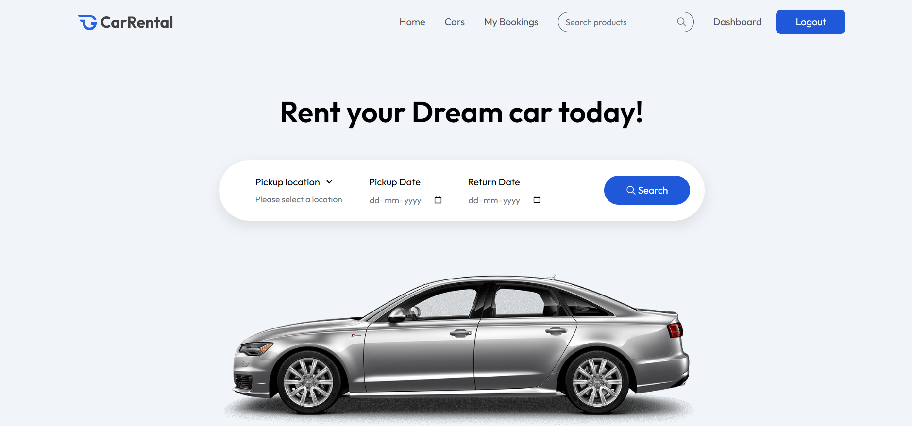

#  Car_Rental_Platform

A modern full-stack Car Rental Platform built using the MERN Stack (MongoDB, Express.js, React.js, Node.js). The application allows users to browse available vehicles, check availability, book cars online, and enables vehicle owners to manage listings, bookings, and revenue through a dedicated dashboard.

---

## 📸 Screenshots

### 🏠 Home Page

Browse featured vehicles, search by location, and start your booking journey.
---
### 🚘 Cars Listing Page

View all available cars with filtering and search functionality.
---
### 📋 Car Details & Booking

See complete vehicle information, select pickup and return dates, and create bookings.
---
### 📅 My Bookings

Track all your bookings and monitor their current status.
---
### 👤 Owner Dashboard

Monitor platform performance including total cars, bookings, revenue, and recent activities.
---
### 🚗 Manage Cars

Owners can view, manage, and update all listed vehicles.
---
### ➕ Add New Car

List new vehicles with images, specifications, pricing, and location details.
---
### 📊 Booking Management

Owners can confirm, cancel, and manage incoming bookings.
---
---
# 🛠️ Tech Stack
## Frontend
* React.js
* React Router DOM
* Axios
* Tailwind CSS
* React Hot Toast
* Context API
## Backend
* Node.js
* Express.js
* MongoDB
* Mongoose
* JWT Authentication
* Multer
* ImageKit
## Database
* MongoDB Atlas
## Media Storage
* ImageKit CDN
---

## 📁 Project Structure

```text
Car_Rental_Platform/
│
├── Client/
│   ├── public/
│   └── src/
│       ├── assets/
│       ├── components/
│       ├── context/
│       └── pages/
│
├── Server/
│   ├── configs/
│   ├── controllers/
│   ├── middleware/
│   ├── models/
│   └── routes/
│
├── screenshots/
│
└── README.md
```
---

# 🔐 Security Features

* Password Hashing using bcrypt
* JWT Authentication
* Protected API Routes
* Owner Authorization Middleware
* Secure Environment Variables

---

# 🚀 Installation

## Clone Repository

```bash
git clone https://github.com/sathwik123677/Car_Rental_platfrom.git

cd Car_Rental_platfrom
```

## Backend Setup

```bash
cd Server

npm install
```

Create a `.env` file:

```env
MONGODB_URI=your_mongodb_connection_string
JWT_SECRET=your_jwt_secret
IMAGEKIT_PUBLIC_KEY=your_public_key
IMAGEKIT_PRIVATE_KEY=your_private_key
IMAGEKIT_URL_ENDPOINT=your_url_endpoint
PORT=5000
```
Run backend:
```bash
npm run server
```
---
## Frontend Setup
```bash
cd Client
npm install
```
Create a `.env` file:
```env
VITE_BASE_URL=http://localhost:5000
VITE_CURRENCY=$
```
Run frontend:
```bash
npm run dev
```
---
# 📌 API Endpoints
## User
```http
POST /api/user/register
POST /api/user/login
GET  /api/user/data
GET  /api/user/cars
```
## Owner
```http
POST /api/owner/change-role
POST /api/owner/add-car
GET  /api/owner/dashboard
GET  /api/owner/cars
```
## Bookings
```http
POST /api/bookings/check-availability
POST /api/bookings/create
GET  /api/bookings/user
GET  /api/bookings/owner
POST /api/bookings/change-status
```
---
# 🎯 Future Enhancements
* Online Payment Integration (Stripe/Razorpay)
* Google Maps Location Search
* Car Reviews & Ratings
* Email Notifications
---
# 👨‍💻 Developer
**Sathwik**
GitHub:
https://github.com/sathwik123677
---
# ⭐ Support
If you found this project useful, please consider giving it a ⭐ on GitHub.
